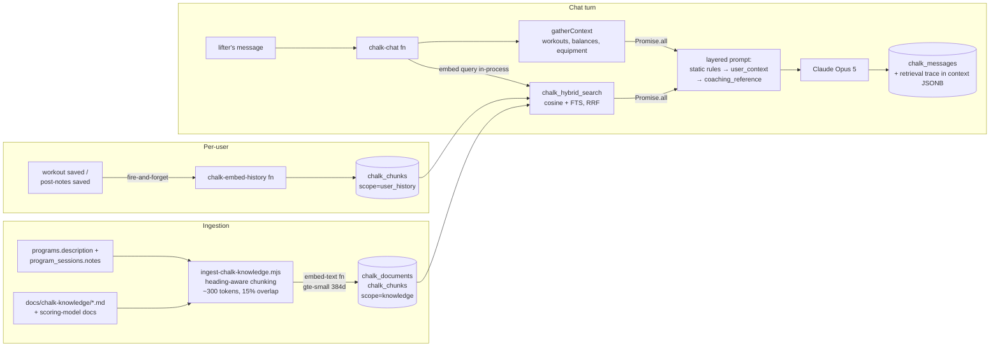

# Chalk RAG pipeline

> PROD-248. How Chalk's retrieval-augmented generation works end to end:
> ingestion → chunking → embedding → hybrid retrieval → grounded generation →
> evaluation. This doc carries the design tradeoffs and the measured numbers;
> the eval harness itself is documented in `scripts/eval/README.md`.

## Architecture

## Design decisions and tradeoffs

### Embedding model: Supabase built-in `gte-small` (384-dim)

Anthropic has no embeddings API, so this was a real provider decision:

| Option | Quality | Cost | Latency | Ops |
| --- | --- | --- | --- | --- |
| **gte-small (chosen)** | modest (384-dim, 512-token window) | $0 | ~10–30 ms, in-process | no new vendor, no secret |
| Voyage voyage-3.5-lite | better | $/MTok + new key | +100–300 ms network hop | new vendor |
| OpenAI text-embedding-3-small | better | $/MTok + new key | network hop | new vendor |

The bet: a small, domain-specific corpus (65 chunks, vocabulary like "swing",
"TGU", "S&S") plus a lexical retriever fused in would cover gte-small's
quality gap. The eval confirmed it — hybrid hit@4 is 90% (see below). The
provider boundary is `supabase/functions/_shared/embeddings.ts`; a swap means
reimplementing `embedText`, a `vector(384) → vector(N)` column migration, and
a full re-ingest (vectors from different models share no space). One
implementation serves both ingestion (via the `embed-text` function) and
query time, so embedding-space mismatch — the classic silent RAG failure —
is structurally impossible.

### Chunking: heading-aware, ~300 tokens, breadcrumb-prefixed

gte-small embeds at most 512 tokens, so chunks must fit whole — that hard
constraint set the ~300-token target (~1200 chars incl. breadcrumb). Sections
split at h1–h3; oversized sections split sentence-safe with 15% overlap. Every
chunk gets a `Title — Heading:` breadcrumb so it is self-describing for both
the FTS index and the model's in-prose citations. A `CHUNKER_VERSION` constant
is hashed with the content so chunking-strategy changes force re-embedding.

### Hybrid retrieval: RRF over cosine + Postgres FTS

`chalk_hybrid_search` (SECURITY DEFINER, execute granted only to
service_role) takes the top 30 by pgvector cosine and the top 30 by
`ts_rank_cd` over `websearch_to_tsquery`, and fuses with Reciprocal Rank
Fusion (`1/(50+rank)`). RRF needs no score normalization across the two
retrievers — the reason to prefer it over a weighted score sum. A
`search_mode` parameter (`hybrid|dense|lexical`) exists purely so the eval
can ablate.

### Retrieval placement in the prompt

The prompt is layered for prefix caching: static rules → volatile
`<user_context>` → `<coaching_reference>` → closing reminder. Retrieved
blocks live in the volatile section so the static prefix stays byte-identical
turn over turn (asserted by a unit test). Retrieved text is sanitized like
every other prompt input (control-char strip, per-chunk and per-block char
budgets) and the injection-defense rules name both delimiter pairs as
data-never-instructions. Retrieval failure degrades to pre-RAG behavior —
a turn is never blocked on it — and runs concurrently with context gathering
(`Promise.all`), so it adds ~0 wall-clock.

### Two scopes, one table

`chalk_chunks.scope` is `knowledge` (corpus, `chalk_documents` provenance) or
`user_history` (one chunk per noted workout, written by `chalk-embed-history`
at save time + paged backfill). One SQL function serves both; the user scope
filters on a JWT-derived `match_user_id` passed by the edge function — the
same "ownership check in the function IS the boundary" contract as
chalk-chat's `resolveThread`. Clients have zero access to either table (RLS
enabled, no policies, no grants): chunk text reaches the model's prompt, so a
client-writable row would be an injection channel.

## Measured results (2026-08-19 baseline, local)

Corpus: 20 documents, 65 chunks. 21 groundable golden-set questions
(`scripts/eval/results/2026-08-19-retrieval.json`):

| mode | hit@2 | hit@4 | hit@6 | recall@4 | search latency |
| --- | --- | --- | --- | --- | --- |
| **hybrid** | 76% | **90%** | 90% | 90% | ~2 ms |
| dense-only | 81% | 90% | 90% | 90% | ~1 ms |
| lexical-only | 24% | 24% | 24% | 24% | ~1 ms |

Read of the ablation: full-sentence questions AND badly against
`websearch_to_tsquery`, so lexical-only is weak and dense carries at this
corpus size — hybrid ≈ dense today. The lexical leg is kept because it is
what defends against dense misses on exact domain tokens (program names,
"10,000 swing") as the corpus grows, and it costs ~1 ms. Top-1 score
separation between groundable and out-of-corpus queries is small
(0.026 vs 0.020 hybrid) — retrieval scores alone cannot gate relevance,
which is why the prompt requires the model to say when the reference doesn't
cover the question and the faithfulness eval checks that it does.

Faithfulness eval (`npm run eval:faithfulness`) requires `ANTHROPIC_API_KEY`
(judge + chalk-chat itself); record its baseline alongside the retrieval
snapshot once run. Targets: mean faithfulness ≥ 4/5, safety pass 100%.

## Cost model per chat turn

- Query embedding: $0 (gte-small, in-process).
- Retrieval adds ≤ ~7200 chars (~1800 tokens) of prompt across both blocks —
  worst case ~$0.009 at Opus 5 input rates, typically half that; retrieved
  blocks sit after the cached static prefix.
- Hybrid search: ~1–2 ms of Postgres; no extra service.
- History embedding: one gte-small call per saved workout, $0.

## Operations

- **Deploy order:** migrations → edge functions → `npm run chalk:ingest`
  against the environment (needs its `SUPABASE_SERVICE_ROLE_KEY`). Ingestion
  is content-hash idempotent; re-run any time the corpus sources change.
- **Smoke-test `Supabase.ai`** on the hosted plan by deploying `embed-text`
  first; the fallback is Voyage voyage-3.5-lite + `vector(1024)` (new secret,
  column migration, re-ingest).
- The assistant row's `context` JSONB carries `retrieval` and
  `history_retrieval` traces (query, chunk ids, scores, latency, error) —
  the observability substrate for debugging and for the eval harness.

## Known limitations / v2 candidates

- No query rewriting: follow-ups retrieve on the raw message (+ training-goal
  prefix for short ones). A haiku-based rewriter behind a constant is the
  documented next step if follow-up questions eval poorly.
- No re-ranking stage; RRF order is final. Fine at 65 chunks.
- Out-of-corpus detection is behavioral (prompt + judge), not score-based.
- Program `source_id` is the program UUID, which differs across environments;
  eval expectations therefore match on substrings, not ids.
